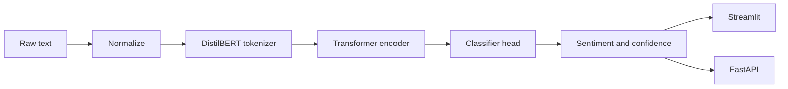

<div align="center">

# Sentiment Lens

### Transformer-powered sentiment analysis for text and review datasets

[](https://www.python.org/)
[](https://pytorch.org/)
[](https://huggingface.co/docs/transformers)
[](https://streamlit.io/)

An end-to-end NLP project that fine-tunes a DistilBERT encoder, exposes a reusable inference layer, and serves it through a focused Streamlit workspace and FastAPI endpoint.

</div>

## What it does

- Classifies text as positive or negative with confidence scores.
- Normalizes HTML, URLs, email addresses, casing, and whitespace before tokenization.
- Analyzes individual reviews or entire CSV files in the web app.
- Exports batch predictions as a new CSV file.
- Supports training, held-out evaluation, metrics, and visual reports.
- Shares one predictor between the UI, command line, and API.

## Architecture



## Run locally

```bash
git clone https://github.com/Nadjiba-Rahal/sentiment-analysis-transformer.git
cd sentiment-analysis-transformer
python -m venv .venv
```

Activate the environment, then install dependencies:

```bash
# Windows PowerShell
.venv\Scripts\Activate.ps1

pip install -r requirements.txt
streamlit run streamlit_app.py
```

The first launch downloads the fine-tuned checkpoint from Hugging Face. It is cached locally after that.

## Interfaces

### Streamlit workspace

```bash
streamlit run streamlit_app.py
```

Use the single-text analyzer for quick exploration or upload a CSV, choose its text column, and download predictions.

### FastAPI service

```bash
uvicorn api:app --reload
```

| Route | Purpose |
|---|---|
| `GET /` | Service information |
| `GET /health` | Runtime health check |
| `POST /predict` | Classify one text payload |
| `GET /docs` | Interactive OpenAPI documentation |

Example request:

```json
{
  "text": "The product exceeded my expectations."
}
```

## Train and evaluate

Prepare a dataset:

```bash
python prepare_data.py --dataset imdb
```

Train and evaluate the model:

```bash
python train.py config.yaml
python visualize.py
```

The pipeline writes checkpoints, training history, evaluation metrics, and plots under `outputs/`. Generated artifacts are ignored by git.

## Repository map

| File | Responsibility |
|---|---|
| `streamlit_app.py` | Interactive text and CSV analysis |
| `api.py` | FastAPI serving layer |
| `predict.py` | Shared model loading and inference |
| `model.py` | Transformer encoder and classification head |
| `preprocess.py` | Text normalization and tokenization |
| `train.py` | Fine-tuning loop and checkpointing |
| `metrics.py` | Evaluation metrics and reports |
| `visualize.py` | Training and evaluation plots |
| `config.yaml` | Model, data, and training configuration |

## Model configuration

Edit `config.yaml` to change the backbone, sequence length, batch size, learning rate, epochs, or output locations. The default backbone is `distilbert-base-uncased` for a practical CPU-friendly inference experience.

## License

No license file is currently included in the repository.
